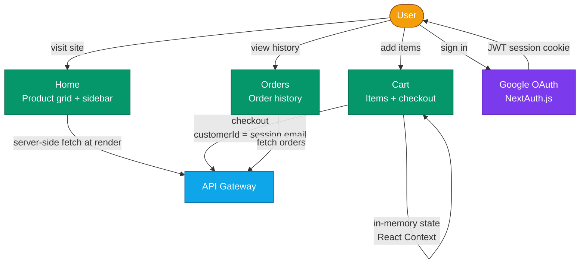
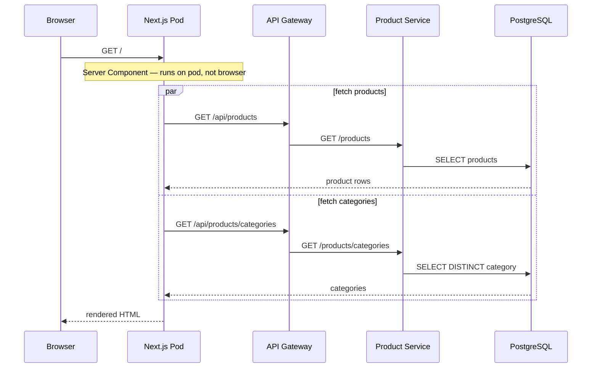
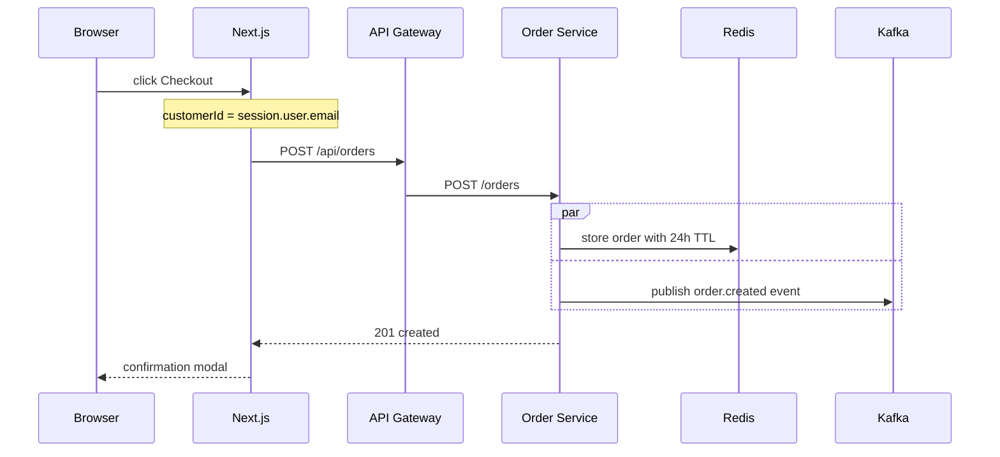
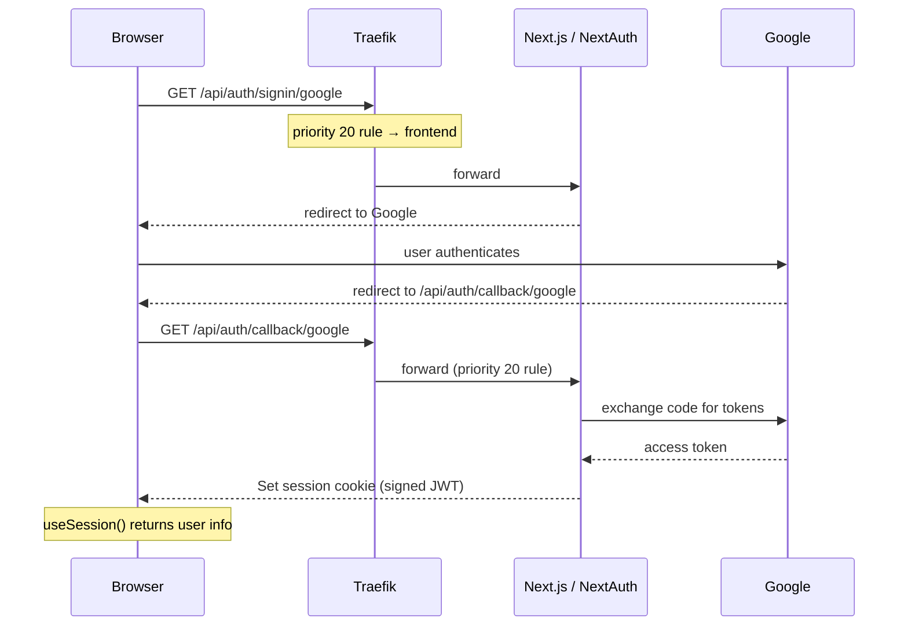
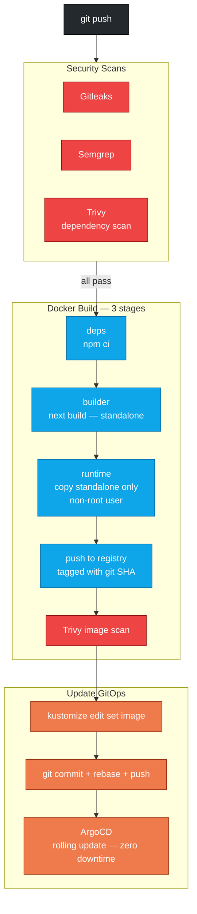

# CloudMart Frontend


Next.js 14 frontend for the CloudMart e-commerce platform. Handles product browsing, cart management, order placement, and Google OAuth authentication.

---

## Repositories

| Repo | Purpose |
|------|---------|
| [cloudmart-gitops](https://github.com/Nidhi-S12/cloudmart-gitops) | Terraform, Helm values, K8s manifests, ArgoCD config |
| [cloudmart-services](https://github.com/Nidhi-S12/cloudmart-services) | Backend microservices |
| [cloudmart-frontend](https://github.com/Nidhi-S12/cloudmart-frontend) | This repo — Next.js frontend |

---

## Stack

| Technology | Purpose |
|-----------|---------|
| **Next.js 14** (App Router) | React framework — server components, file-based routing |
| **NextAuth.js v5** | Google OAuth authentication |
| **Docker** | Multi-stage container build |
| **GitHub Actions** | CI — security scans, build, push to GHCR |
| **ArgoCD** | CD — GitOps deployment to EKS (manifests in cloudmart-gitops) |

---

## Application Flow



---

## Data Flows

### Page load — product listing



### Checkout flow



### Google OAuth login



> **Why priority 20?** Without this Traefik rule, `/api/auth/*` would route to the api-gateway (priority 10), which returns 404. The higher-priority rule ensures NextAuth callbacks always reach the frontend.

---

## Authentication

Google OAuth via NextAuth.js v5 with App Router. Handles the full OAuth flow — redirects, token exchange, session management — without writing auth logic from scratch.

| Variable | Source | Description |
|----------|--------|-------------|
| `GOOGLE_CLIENT_ID` | AWS Secrets Manager | Google Cloud Console OAuth 2.0 |
| `GOOGLE_CLIENT_SECRET` | AWS Secrets Manager | Google Cloud Console OAuth 2.0 |
| `NEXTAUTH_SECRET` | AWS Secrets Manager | Signs JWT session cookies |
| `NEXTAUTH_URL` | Kustomize patch | Full public URL of the app |

---

## CI Pipeline



---

## Pages & Components

```
src/
├── app/
│   ├── page.js                          # Home — product grid + sidebar (SSR)
│   ├── cart/page.js                     # Cart — items, quantities, checkout
│   ├── orders/page.js                   # Order history
│   ├── layout.js                        # Root layout — wraps with Providers
│   └── api/
│       ├── auth/[...nextauth]/route.js  # NextAuth handler (Google OAuth)
│       └── health/route.js             # Health check for K8s probes
├── components/
│   ├── Header.jsx           # Nav — sign in/out, cart link
│   ├── ProductCard.jsx      # Product tile
│   ├── CategorySidebar.jsx  # Category filter
│   ├── OrderModal.jsx       # Order confirmation modal
│   └── Providers.jsx        # SessionProvider + CartProvider wrapper
├── context/
│   └── CartContext.jsx      # Client-side cart state (React Context)
└── lib/
    └── api.js               # fetch wrappers for all API calls
```

---

## Environment Variables

| Variable | Set by | Description |
|----------|--------|-------------|
| `NEXT_PUBLIC_API_URL` | Kustomize patch | API base URL — baked into JS bundle at build time |
| `NEXTAUTH_URL` | Kustomize patch | Full public URL — required by NextAuth |
| `GOOGLE_CLIENT_ID` | External Secrets (AWS SM) | Google OAuth client ID |
| `GOOGLE_CLIENT_SECRET` | External Secrets (AWS SM) | Google OAuth client secret |
| `NEXTAUTH_SECRET` | External Secrets (AWS SM) | JWT signing secret |

`NEXT_PUBLIC_*` vars are baked into the JS bundle at build time. All others are injected at pod startup via K8s Secrets.

---

## Local Development

```bash
npm install

cat > .env.local <<EOF
NEXT_PUBLIC_API_URL=http://localhost:4000
NEXTAUTH_URL=http://localhost:3000
NEXTAUTH_SECRET=any-random-string-for-local-dev
GOOGLE_CLIENT_ID=your-google-client-id
GOOGLE_CLIENT_SECRET=your-google-client-secret
EOF

npm run dev
# → http://localhost:3000
```

> Backend services must be running. Use the Docker Compose setup in cloudmart-services.
